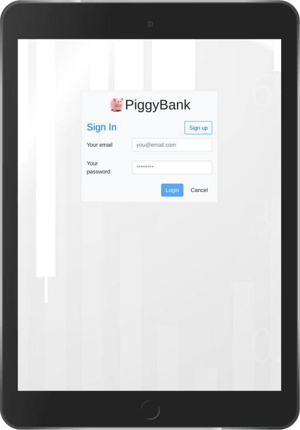
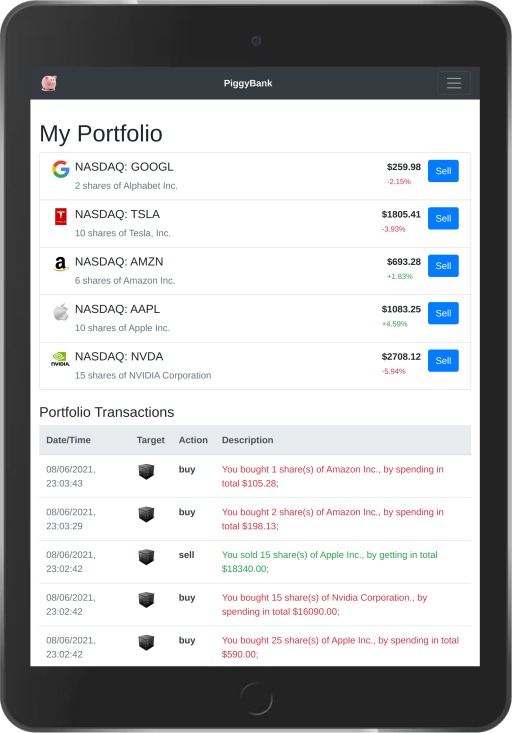
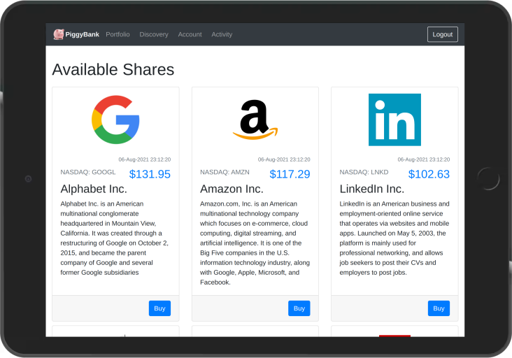
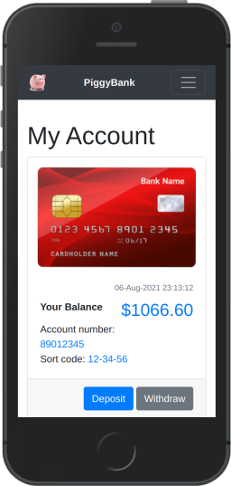
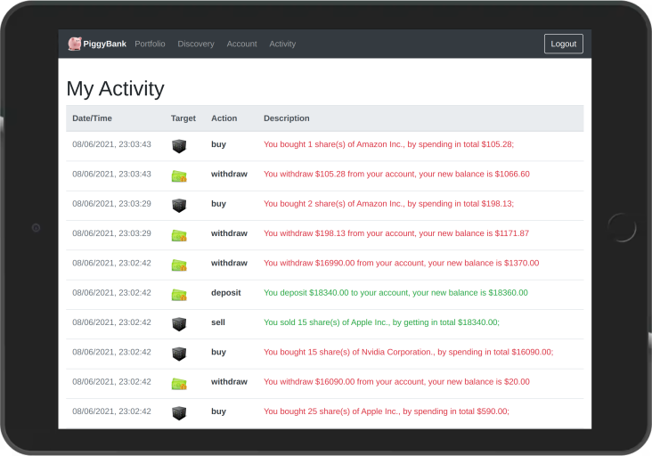

# Welcome to PiggyBank Demo Application


The goal of this application is to demonstrate the capability of the Bootwrap library. This demo implements a mock of investment platforms where you can trading companies shares. Lets run it with following command:

```bash
~$ ./helper.sh demo
```

## What this investment platform allows to do?

1. Create your training account;
2. Deposit and withdraw a found;
3. Discover, buy, and sell shares;
4. Monitor your trading activity;

## User Guide

This guide will walk you through the main demo application functionality. Please note, we are intentionally using screenshots from different devices and different rotations. This demonstrates that your application is properly resized regardless of which device your users will using.

### Login

Type the following address `http://127.0.0.1:5000/` in your browser and you will be landed on the login page.



Since you do not have an account, click on the button "Sign Up" to create one. Alternatively, you can use a demo account of Jordan Belfort, which we already prepared for you. Well, at this stage, you might be asking yourself: who is this person? The next quote from [Wikipedia](https://en.wikipedia.org/wiki/The_Wolf_of_Wall_Street_(2013_film)) will explain this.

>The Wolf of Wall Street is a 2013 American epic biographical black comedy crime film directed by Martin Scorsese and written by Terence Winter, based on the 2007 memoir of the same name by Jordan Belfort.

To login into Jordan Belfort's use the following credentials:

| Field    | Value                   |
|----------|-------------------------|
| Email    | j.belfort@notexist.com  |
| Password | HardWork@2021           |

If you are wondering how we come up with this password see the movie quote (it will help you to remember it):


### Portfolio

After the successful login, you will be prompted to your portfolio containing shares you owned. The log below shows what and when you bought or sold.



For each company, you can see the number of shares, their current value, and the option to sell all or some of them. The red/green percentage figure indicates whether or not your loss/gain is in the relation to the original value you paid.

### Discovery

After checking your portfolio let's go to the discovery page.



Use this page to search for your perfect investment. You can see all companies available on the stock market, read a little bit about each, and check their share prices. If you spot an investment opportunity go click on the button "Buy" and perches the amount shares you desire.

If you found yourself sort on cash got to the account page.

### Discovery

From the account page, you can deposit and withdraw some funds.



This page is showing your investment account number, sort code, and balance available for you to spend. If you need more click on the button "Deposit" and specify the amount to put in. But do not forget to "Withdraw" some for your entertainment.


### Activity

And last but not least be always on top of your spending and never get into trouble using the activity page. 

